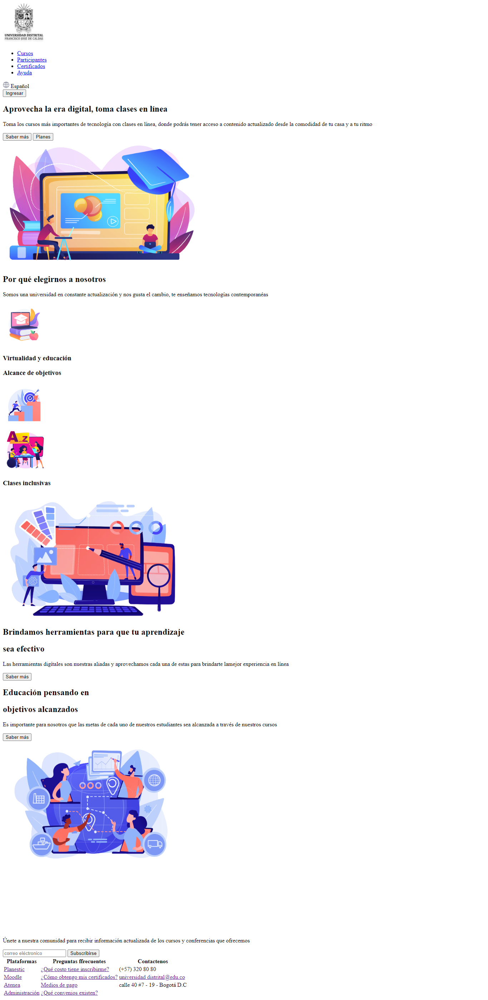
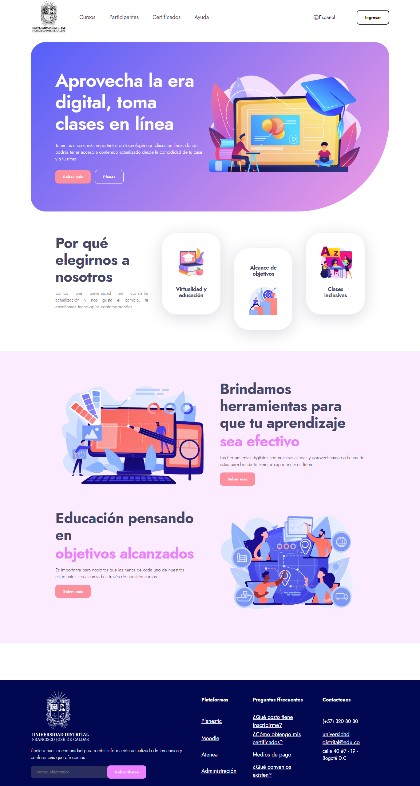
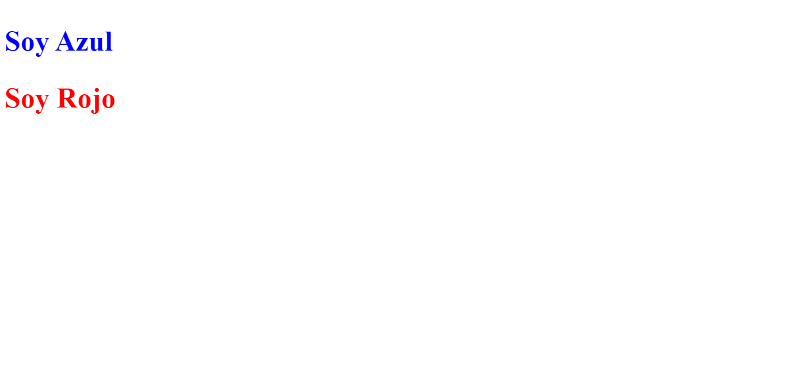
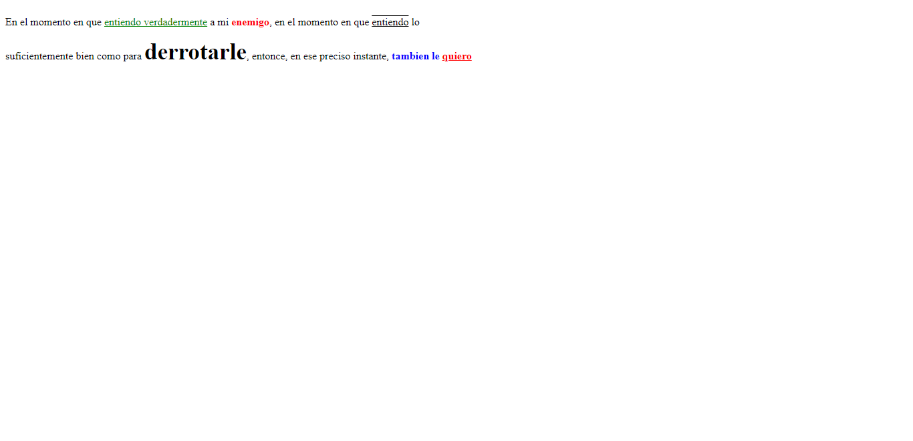
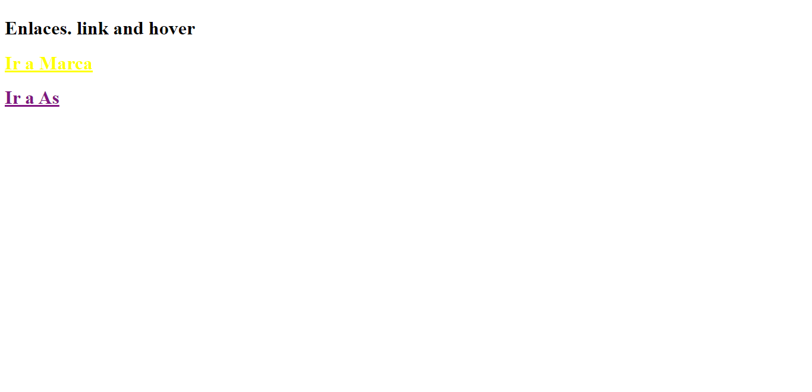
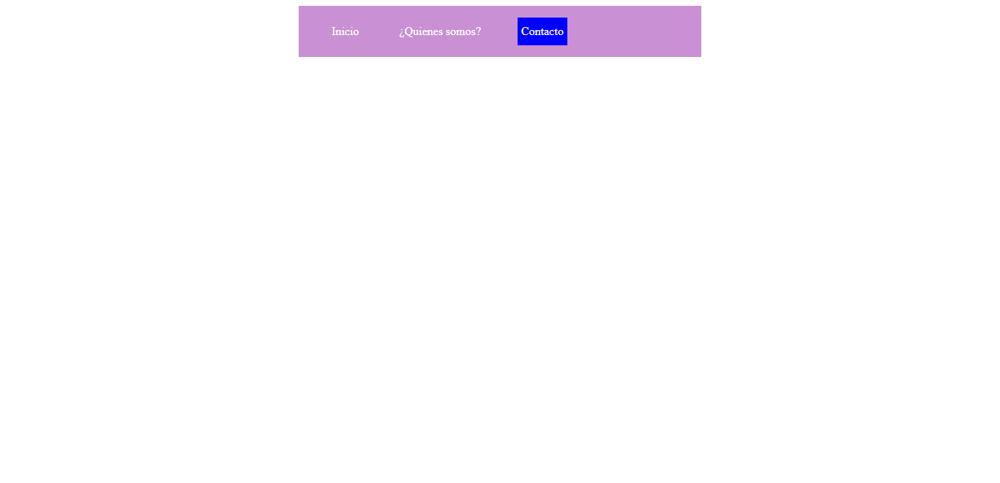
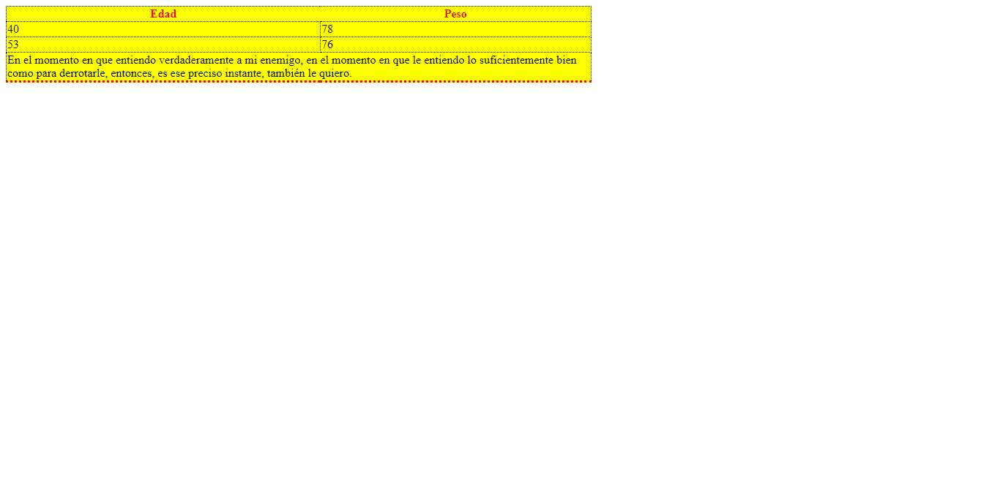

<h1>Taller 9 Oscar Andrey Rodriguez Urrego</h1>

<h2> Información</h2>

Curso: full Stack Basico - Grupo 1

Profesor: Cristian Patiño

<h3>Link Página Web</h3>
<a href="https://oscarrz9.github.io/taller_9_full_satck/" target="_blank">Página Web</a>

<h2> Punto 1: Link figma</h2>

<a href="https://www.figma.com/file/aoPS1YCrMJnveRhn4eRKEY/Oscar-Rodriguez---Figma-Excercise?type=design&node-id=0%3A1&mode=design&t=3kvB3QeHHZWZTLiW-1" target="_blank">Link de Figma</a>

<h2>Punto 2: HTML</h2>

<h2>Punto 3: CSS</h2>

<h2>Punto 4: Títulos</h2>

<h2>Punto 5: Párrafos</h2>

<h2>Punto 6: Enlaces</h2>

<h2>Punto 7-8: Barra de navegacón</h2>

<h2>Punto 9: Tabla</h2>
